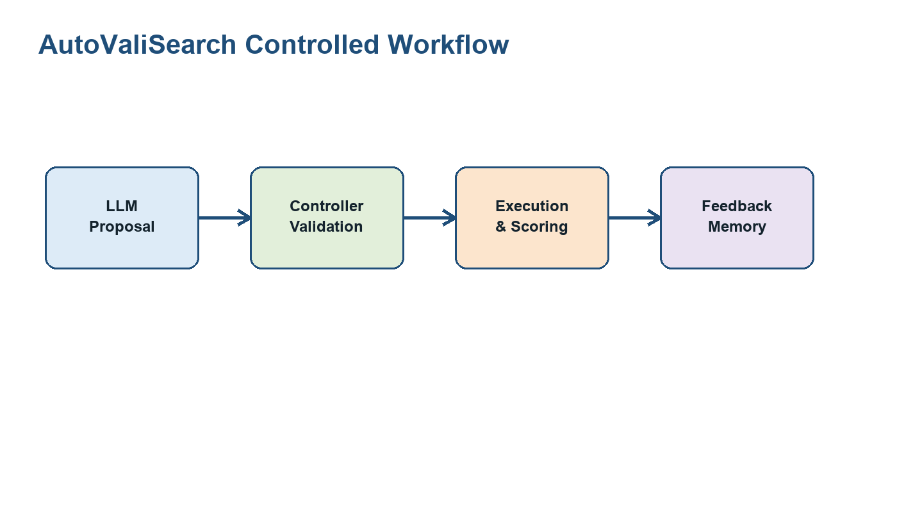

# AutoValiSearch

面向视觉训练实验的受控 LLM 自动研究工作流：大模型提出实验配置和验证策略，控制器负责校验、执行、记录和复盘。



## 1. 项目概览

AutoValiSearch 展示的是一个工程化的两阶段工作流：

- Stage I: 训练配置搜索
- Stage II: 验证策略搜索

它把 LLM 的决策能力限制在结构化、可验证的空间内，让每一轮实验都有明确的输入、输出和反馈路径。

## 2. 核心能力

- 有界配置搜索
- 结构化 JSON 输出
- controller 校验与 repair
- 训练与验证的自动化执行
- 结构化实验 trace
- 基于历史结果的迭代反馈

## 3. 系统设计

### Stage I: Configuration Search

Stage I 搜索训练配置。LLM 在固定模板和离散参数空间内提出候选配置，controller 校验后再进入训练执行。

当前 Stage I 参数：

| 参数 | 含义 |
|---|---|
| `lr` | 外层分类器学习率 |
| `lambdap` | decorrelation 与 smoothing 的权衡强度 |
| `epochp` | stable reweighting 启动 epoch |
| `num_f` | random Fourier feature / feature partition 数量 |

每个参数 8 个候选值，总搜索空间为：

```text
8 x 8 x 8 x 8 = 4096 configurations
```

一个 Stage I trial 的单位是：

```text
one config -> 4 domain splits x 2 seeds -> aggregate result
```

### Stage II: Validation Workflow

Stage II 搜索验证策略，用于 checkpoint selection。

LLM 在受限 DSL 中提出 validation policy。controller 负责：

- 编译 policy
- 校验 validation view
- 计算或复用 view score
- 应用 safety fallback
- 输出 deployable 指标与 analysis-only 上界

## 4. 受控工作流

系统职责划分如下：

| 组件 | 职责 |
|---|---|
| LLM Agent | 提出训练配置或验证策略 |
| Controller | 校验 schema、参数范围、重复项和安全规则 |
| Executor | 执行训练或验证评分 |
| Memory | 保存 trial 历史和反馈 |
| Reporter | 汇总结构化 artifacts 中的指标 |

状态流：

```text
memory -> propose -> validate/repair -> execute -> aggregate -> feedback -> next proposal
```

## 5. 示例 Trace

Stage I trace 示例：

```json
{
  "proposal": {"lr": 0.01, "lambdap": 1.0, "epochp": 5, "num_f": 3},
  "controller_status": "accepted",
  "trial_unit": "4 splits x 2 seeds",
  "result": {"mean_test_acc": 77.226050},
  "next_feedback": "keep stable anchor behavior; probe nearby schedules"
}
```

Stage II trace 示例：

```json
{
  "policy_name": "source_dominant_weighted_v7",
  "views": ["source_val", "color_jitter", "blur"],
  "aggregation": "weighted_mean",
  "safety_rule": "fallback_to_vanilla_if_underperform",
  "deployable_improvement_over_vanilla": 0.136463
}
```

更多示例见：

```text
examples/experiment_trace.md
examples/config_search_case.md
examples/validation_case.md
```

## 6. 实验结果摘要

仓库内的 sample artifacts 来自一次 PACS / VLCS 正式实验摘要。

### Stage I: Configuration Search

| Dataset | LLM best | BoTorch best | TPE best |
|---|---:|---:|---:|
| PACS | 77.226 | 76.810 | 76.902 |
| VLCS | 67.852 | 67.478 | 67.721 |

### Stage II: Validation Workflow

| Dataset | Best validation policy | Deployable selected test | Gain over vanilla | Analysis upper bound |
|---|---|---:|---:|---:|
| PACS | `robust_rank_weighted_v11` | 77.736 | +0.510 | 78.310 |
| VLCS | `source_dominant_weighted_v7` | 67.988 | +0.136 | 68.874 |

`Analysis upper bound` 使用 test 信息，仅用于离线分析。

## 7. 仓库结构

```text
autovalisearch/
├── README.md
├── LICENSE
├── requirements.txt
├── PACKAGE_MANIFEST.md
├── agents/
├── baselines/
├── controller/
├── dataset/
├── llm/
├── models/
├── outer/
├── phase1_search/
├── phase2b_validation/
├── reporting/
├── scripts/
│   ├── run_trial.py
│   ├── run_phase1_formal_suite.py
│   ├── run_phase2b_formal_suite.py
│   ├── run_full_pipeline.py
│   └── write_backend_config.py
├── training/
├── utils/
├── docs/
│   ├── AUTOVALISEARCH_TECHNICAL_REPORT.md
│   ├── AUTOVALISEARCH_5PAGE.docx
│   └── AUTOVALISEARCH_5PAGE.pdf
├── figures/
├── examples/
│   ├── run_training_trial.py
│   ├── run_showcase_demo.py
│   ├── experiment_trace.md
│   ├── config_search_case.md
│   └── validation_case.md
├── artifacts/
└── src/
```

## 8. 可运行入口

- 真实训练 trial：`python scripts/run_trial.py --config path/to/config.json --trial_dir path/to/trial_dir`
- Stage I formal suite：`python scripts/run_phase1_formal_suite.py`
- Stage II formal suite：`python scripts/run_phase2b_formal_suite.py`
- 全流程：`python scripts/run_full_pipeline.py`

## 9. License

This project is licensed under the Apache-2.0 License.
